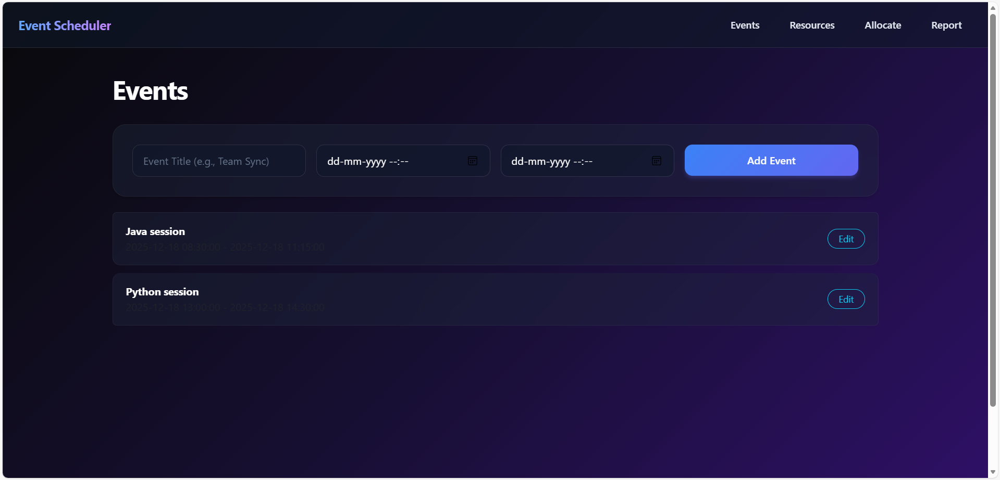
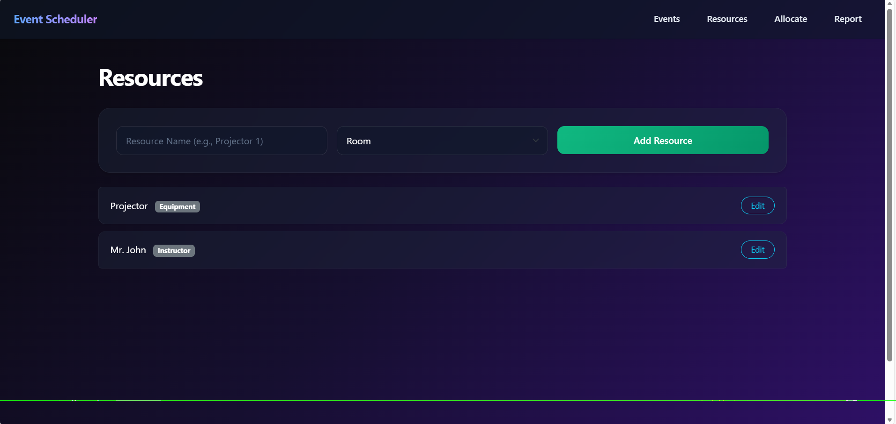
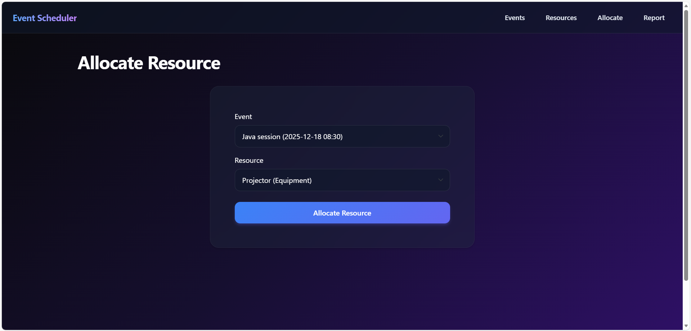

# Event Scheduler & Resource Allocation System

A modern, full-stack Flask application designed to streamline the scheduling of events and allocation of resources (Rooms, Equipment, Instructors). The system features a robust conflict detection engine, an interactive dashboard, and a premium dark-themed UI.


## 🎥 Demo Video
[Watch the Event Scheduler Demo](https://drive.google.com/file/d/1Uox46t6Icavw7uTlUkqunJdL2rx2V7jI/view?usp=sharing)

## 🚀 Features

### Core Functionality
- **Event Management**: Create, Edit, and Delete events with precise start and end times.
- **Resource Management**: Manage various resource types (Rooms, Equipment, Instructors).
- **Smart Allocation**: Assign resources to events with a simple, dynamic selection interface.
- **Conflict Detection**:
    - Real-time validation prevents allocating resources to overlapping events.
    - Detailed **Conflict Report** page showing exactly which event causes the clash.
- **Utilization Dashboard**:
    - Track resource usage hours within custom date ranges.
    - View upcoming booking counts for each resource.

### User Experience (UI/UX)
- **Premium Dark Mode**: Sleek gradient background with glassmorphism effects.
- **Responsive Design**: Works on desktop and mobile.
- **Native Time Picking**: Uses browser-native `datetime-local` inputs for easy 24-hour time selection.
- **High Contrast**: Optimized white typography for maximum readability.

## 🛠️ Technologies Used
- **Backend**: Python, Flask, Flask-SQLAlchemy, Flask-WTF
- **Database**: SQLite
- **Frontend**: HTML5, CSS3 (Custom + Bootstrap 5), Jinja2 Templating
- **Tools**: Python virtual environment (`venv`)

## ⚙️ Installation & Setup

1.  **Clone the Repository**
    ```bash
    git clone <repository-url>
    cd event_scheduler
    ```

2.  **Create a Virtual Environment**
    ```bash
    python -m venv venv
    ```

3.  **Activate the Virtual Environment**
    - Windows:
        ```bash
        venv\Scripts\activate
        ```
    - Mac/Linux:
        ```bash
        source venv/bin/activate
        ```

4.  **Install Dependencies**
    ```bash
    pip install flask flask-sqlalchemy flask-wtf
    ```

5.  **Initialize the Database**
    The application will automatically create `events.db` on the first run.

## 🏃‍♂️ Running the Application

1.  **Start the Server**
    ```bash
    python app.py
    ```

2.  **Access the App**
    Open your browser and navigate to: [http://127.0.0.1:5000](http://127.0.0.1:5000)

## 📂 Project Structure

```
event_scheduler/
├── static/
│   └── style.css       # Global styles (Dark theme, Animations)
├── templates/
│   ├── base.html       # Base template with Navigation
│   ├── events.html     # Event list & creation form
│   ├── resources.html  # Resource list & creation form
│   ├── allocate.html   # Allocation logic & form
│   ├── conflicts.html  # Conflict details view
│   └── report.html     # Utilization Dashboard
├── app.py              # Main Flask Application & Logic
├── models.py           # Database Models (Event, Resource, Allocation)
├── forms.py            # WTForms definitions
└── reset_db.py         # Utility script to clear database
```

## ✨ Usage Guide

1.  **Add Resources**: Go to the **Resources** tab and add your Rooms or Equipment.
2.  **Create Events**: Go to the **Events** tab to schedule your events.
3.  **Allocate**: Use the **Allocate** tab to link an Event to a Resource.
4.  **Check Reports**: Use the **Report** tab to see how much your resources are being used.








